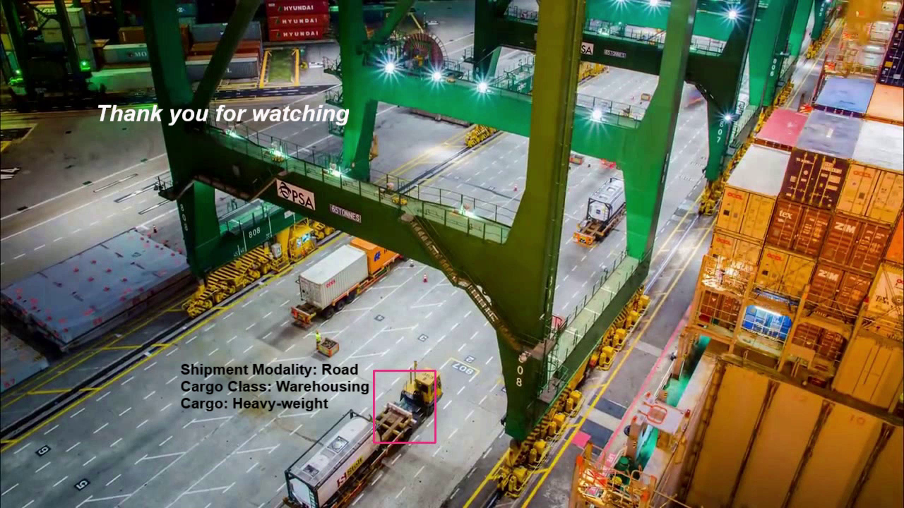
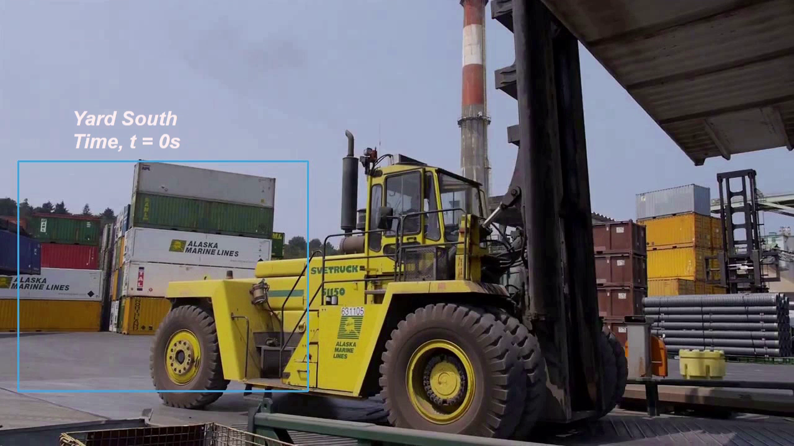
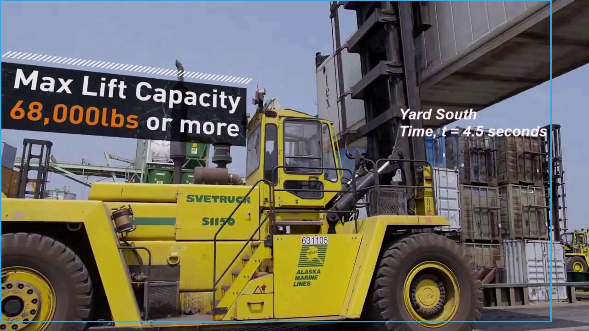
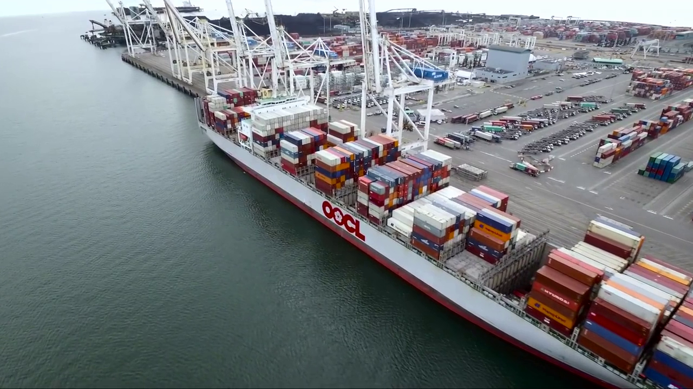
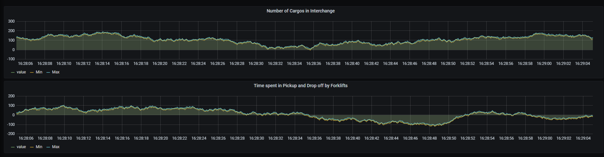

# Congestion Cargo Yards

**Congestion on Cargo Yards**

**Dataset Collected:**

[Video Sources on Cargo Yards](https://drive.google.com/drive/folders/1nr89DsZTsAv2hEciM6e6UEqJhYKa2ToT?usp=sharing)

## PROJECT PLANNING STAGE

### Introduction

A **Supply Chain Manager** takes control of the yard for delivering cargos at the Interchange. The person does this for managing the cargo congestion. Cargo congestion is in turn the responsibility of the **Yard Manager** who ensures effective measures are in place for facilities management. 

A Cargo undergoes lifecycle stages from: Picking up from Ships and loading into the Yard, then drop-off the cargo containers at the Interchange and finally delivering the cargo via a routed shipment mode. 

## PROJECT ELICITATION STAGE

### Watching the Cargo Yard

**Cargo Queue Management at the Interchange**
---------------------------------------------

_The Interchange shows Technical Metadata at the end of the Cargo lifecycle_

[https://journal-ai-php-logs.s3.eu-west-2.amazonaws.com/video-0-1-full.gif](https://journal-ai-php-logs.s3.eu-west-2.amazonaws.com/video-0-1-full.gif)

**Measuring the Time Taken**
----------------------------

_The time taken is Operational Metadata that tracks individually the forklift within the surveillance video_

[https://journal-ai-php-logs.s3.eu-west-2.amazonaws.com/video-2-3-middle-part.gif](https://journal-ai-php-logs.s3.eu-west-2.amazonaws.com/video-2-3-middle-part.gif)

### Annotation of Video using Vehicles In Traffic

**How you describe your Traffic Congestion within the yard has been explained here. With this video one can achieve annotation to a greater degree of accuracy with very less model complexity.**

[https://github.com/nscalo/congestion-cargo-yards/blob/develop/congestion-cargo-yards/annotation/create_id_for_vehicle.ipynb](https://github.com/nscalo/congestion-cargo-yards/blob/develop/congestion-cargo-yards/annotation/create_id_for_vehicle.ipynb)

**Monitoring Environment**
--------------------------

**We use Image Segmentation for tracking containers within the Yard**

**We have created a simulation dashboard where**

- Number of cargos in the Interchange

- Relative Time spent by Forklifts and Heavylifts for pickup and drop-off of cargos

- These indicate the video inference from OpenVINO can be pushed to Grafana Server where the Yard Manager and Supply Chain Manager can make decisions. 

- IoT data on RFID Stickers are also used to track each cargo container thereby increasing the efficiency

Project Maintainers
-------------------

Aswin Vijayakumar       [@nscalo](https://github.com/nscalo)

Rutvik Chauhan          [@Rutvik21](https://github.com/Rutvik21)

Divya Chhibber          [@divyavit](https://github.com/divyavit)

