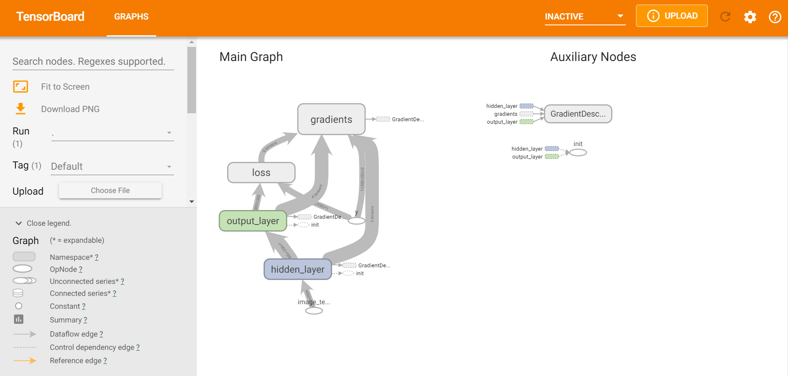
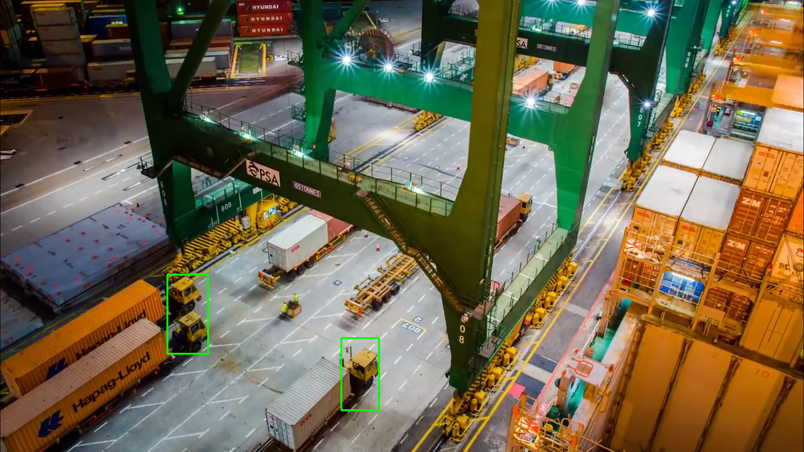

# Congestion on Cargo Yards


# Model Downloader

## Downloading the Model

Try Model "Person-Vehicle-Bike":

```bash

root@docker-box:/opt/intel/openvino/deployment_tools/tools/model_downloader# python3 downloader.py \
--name "person-vehicle-bike-detection-crossroad-0078" \
--output_dir /home/project/models

```

Download TF Model "SSD-Mobilenet-v1-COCO":

[https://github.com/bkj/tf-models/blob/master/research/object_detection/object_detection_tutorial.ipynb](https://github.com/bkj/tf-models/blob/master/research/object_detection/object_detection_tutorial.ipynb)

```bash

python tensorflow_toolkit.py

```

```bash

python3 tensorflow_convert_pb_to_pbtxt.py

```

## Visualizing TensorflowModel using Tensorboard

```bash

root@docker-box:/home/project/toolkit# python3 tensorboard.py

```



## Visualizing TensorflowModel using Netron

```bash

root@37f902f9e5aa/home/project# pip3 install netron
root@37f902f9e5aa:/home/project/toolkit/ssd_mobilenet_v1_coco_2017_11_17# netron -b frozen_inference_graph.pb \
--host 0.0.0.0 --port 8080
Serving 'frozen_inference_graph.pb' at http://0.0.0.0:8080

```


## Detect Vehicles from OpenVINO Model

```bash
git checkout a94aa5dfb184d83523a74caee54f478a66a2e487 -b test_branch
```

```bash

root@37f902f9e5aa:/home/project/congestion-cargo-yards# python3 main.py \
-m /home/project/models/intel/person-vehicle-bike-detection-crossroad-0078/FP32/person-vehicle-bike-detection-crossroad-0078.xml \
-vds "/home/project/images/automated-queue.png" \
-d CPU -bt 1 --batch_size 1 -pt 0.11 \
--relative_overlap_area 1.0 --relative_union_area 1.0 --iou_threshold 0.1 \
--finalize_iou_boxes 1

```



<!--
```bash

root@37f902f9e5aa:/home/project/congestion-cargo-yards# python3 main.py -m /home/project/models/intel/person-vehicle-bike-detection-crossroad-yolov3-1020/FP32/person-vehicle-bike-detection-crossroad-yolov3-1020.xml -vds "/home/project/images/automated-queue.png" -d CPU -bt 1 --batch_size 1 -pt 0.11 --prob_threshold 0.05 --iou_threshold 1.0 --yolo 1 --dict_export 1

```


-->

```bash

root@37f902f9e5aa:/home/project/congestion-cargo-yards# python3 main.py \
-m /home/project/models/intel/person-vehicle-bike-detection-crossroad-0078/FP32/person-vehicle-bike-detection-crossroad-0078.xml \
-vds "/home/project/images/cargo-inside-forklift.png" \
-d CPU -bt 1 --batch_size 1 -pt 0.3 \
--relative_overlap_area 1.0 --relative_union_area 1.0 --iou_threshold 0.1 \
--finalize_iou_boxes 1

```


```bash

root@37f902f9e5aa:/home/project/congestion-cargo-yards# python3 main.py \
-m /home/project/models/intel/person-vehicle-bike-detection-crossroad-0078/FP32/person-vehicle-bike-detection-crossroad-0078.xml \
-vds "/home/project/images/forklift-back.png" \
-d CPU -bt 1 --batch_size 1 -pt 0.4

```


```bash

root@37f902f9e5aa:/home/project/congestion-cargo-yards# python3 main.py \
-m /home/project/models/intel/person-vehicle-bike-detection-crossroad-0078/FP32/person-vehicle-bike-detection-crossroad-0078.xml \
-vds "/home/project/images/forklift-carry-weight.png" \
-d CPU -bt 1 --batch_size 1 -pt 0.25

```


```bash

root@37f902f9e5aa:/home/project/congestion-cargo-yards# python3 main.py \
-m /home/project/models/intel/person-vehicle-bike-detection-crossroad-0078/FP32/person-vehicle-bike-detection-crossroad-0078.xml \
-vds "/home/project/images/forklift-stationary-cog-drill.png" \
-d CPU -bt 1 --batch_size 1 -pt 0.2

```


```bash

root@37f902f9e5aa:/home/project/congestion-cargo-yards# python3 main.py \
-m /home/project/models/intel/person-vehicle-bike-detection-crossroad-0078/FP32/person-vehicle-bike-detection-crossroad-0078.xml \
-vds "/home/project/images/forklift-top.png" \
-d CPU -bt 1 --batch_size 1 -pt 0.25 \
 --relative_overlap_area 1.0 --relative_union_area 1.0 --iou_threshold 0.1 \
 --finalize_iou_boxes 1

```


## Convert TF Model to OpenVINO


Project Maintainers
-------------------

Aswin Vijayakumar       [@nscalo](https://github.com/nscalo)

Rutvik Chauhan          [@Rutvik21](https://github.com/Rutvik21)

Divya Chhibber          [@divyavit](https://github.com/divyavit)
